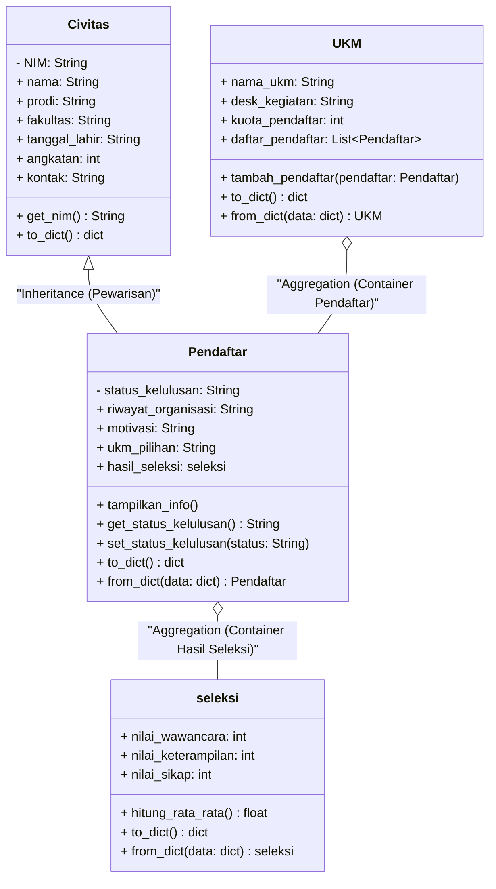
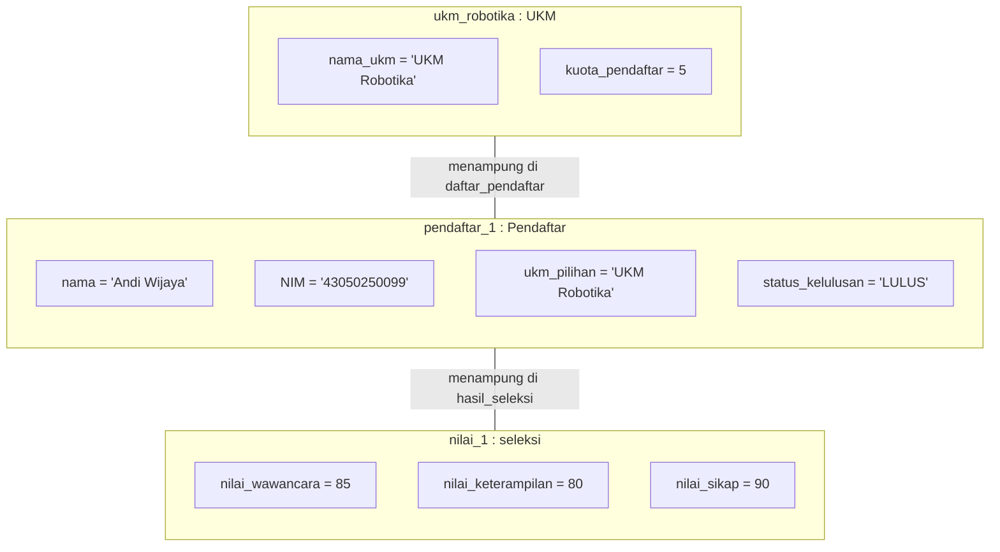
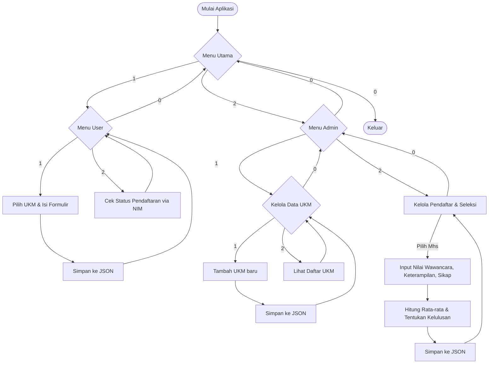

# LAPORAN PROYEK AKHIR PRAKTIKUM PEMROGRAMAN BERORIENTASI OBJEK

## SPORMAWA-PBO: Sistem Pendaftaran Organisasi Mahasiswa

---

<p align="center">
  
</p>

### IDENTITAS KELOMPOK (KELOMPOK 7)

1. **Andi Kurniawan** (NIM: 43050250031) - _Spesialis Logika Bisnis_
2. **Miftakhul Anwar** (NIM: 43050250010) - _Perancang Arsitektur_
3. **Muhammad Fathir Al Faruq** (NIM: 43050250011) - _Backend_
4. **Rizky Angfauzy** (NIM: 43050250034) - _CLI Developer_

### INSTITUSI

**Program Studi Teknologi Informasi (S1)**  
**Fakultas Sains dan Teknologi**  
**Universitas Islam Negeri Salatiga**  
**2026**

---

## DAFTAR ISI

1. [BAB I: PENDAHULUAN](#bab-i-pendahuluan)
   - [1.1 Latar Belakang Tema](#11-latar-belakang-tema)
   - [1.2 Batasan Sistem](#12-batasan-sistem)
2. [BAB II: PERANCANGAN ARSITEKTUR DAN CLASS](#bab-ii-perancangan-arsitektur-dan-class)
   - [2.1 Deklarasi Entitas (Class)](#21-deklarasi-entitas-class)
   - [2.2 Representasi Struktur Kode](#22-representasi-struktur-kode)
   - [2.3 Rancangan Agregasi (Relasi Objek)](#23-rancangan-agregasi-relasi-objek)
3. [BAB III: IMPLEMENTASI PILAR OOP](#bab-iii-implementasi-pilar-oop)
   - [3.1 Enkapsulasi (Encapsulation)](#31-enkapsulasi-encapsulation)
   - [3.2 Pewarisan (Inheritance)](#32-pewarisan-inheritance)
   - [3.3 Polimorfisme (Polymorphism)](#33-polimorfisme-polymorphism)
4. [BAB IV: IMPLEMENTASI ANTARMUKA DAN LOGIKA BISNIS](#bab-iv-implementasi-antarmuka-dan-logika-bisnis)
   - [4.1 Alur Menu Interaktif (CLI)](#41-alur-menu-interaktif-cli)
   - [4.2 Validasi dan Penanganan Kesalahan (Error Handling)](#42-validasi-dan-penanganan-kesalahan-error-handling)
5. [BAB V: PENGUJIAN DAN TANGKAPAN LAYAR](#bab-v-pengujian-dan-tangkapan-layar)
   - [5.1 Skenario Pengujian](#51-skenario-pengujian)
   - [5.2 Tangkapan Layar (Screenshot) Terminal](#52-tangkapan-layar-screenshot-terminal)
6. [BAB VI: PENUTUP](#bab-vi-penutup)
   - [6.1 Kesimpulan](#61-kesimpulan)
   - [6.2 Pembagian Tugas Anggota Kelompok](#62-pembagian-tugas-anggota-kelompok)
7. [LAMPIRAN: SOURCE CODE](#lampiran-source-code)

---

## DAFTAR GAMBAR

1. [Gambar 2.1: Diagram Kelas UML SPORMAWA-PBO](#22-representasi-struktur-kode)
2. [Gambar 2.2: Visualisasi Relasi Agregasi Objek](#23-rancangan-agregasi-relasi-objek)
3. [Gambar 4.1: Flowchart Alur Menu Interaktif CLI](#41-alur-menu-interaktif-cli)

---

## BAB I: PENDAHULUAN

### 1.1 Latar Belakang Tema

Organisasi Mahasiswa (ORMAWA) dan Unit Kegiatan Mahasiswa (UKM) merupakan pilar penting dalam pengembangan _soft skills_, kepemimpinan, dan minat bakat mahasiswa di lingkungan perguruan tinggi. Namun, proses pendaftaran dan seleksi anggota baru ORMAWA sering kali masih dilakukan secara manual menggunakan formulir kertas atau Google Form terpisah. Hal ini menimbulkan tantangan koordinasi bagi pengurus UKM (Admin) dalam merekapitulasi data pendaftar, melakukan seleksi nilai, memvalidasi kuota penerimaan secara presisi, serta mengumumkan hasil seleksi secara efisien.

Oleh karena itu, dirancang **SPORMAWA-PBO (Sistem Pendaftaran Organisasi Mahasiswa)** berbasis Command Line Interface (CLI). Sistem ini bertujuan mendigitalisasi proses pendaftaran mahasiswa dan mempermudah Admin dalam mengelola data UKM serta menginput nilai seleksi pendaftar secara otomatis menggunakan prinsip Pemrograman Berorientasi Objek (OOP) guna menjamin kualitas kode yang modular, terstruktur, dan mudah dikembangkan.

### 1.2 Batasan Sistem

Untuk menjaga fokus pengembangan pada penerapan pilar-pilar OOP, sistem ini dibatasi oleh beberapa ketentuan berikut:

1. **Antarmuka Berbasis Teks (CLI):** Interaksi pengguna sepenuhnya menggunakan terminal teks melalui menu-menu interaktif.
2. **Interactive Loop:** Sistem berjalan terus-menerus menggunakan perulangan interaktif (`while True`) dan hanya akan berhenti saat pengguna memilih menu keluar.
3. **Penyimpanan Berkas JSON (Local Persistence):** Penyimpanan data dilakukan menggunakan berkas `data_ormawa.json`. Sebelum disimpan, objek di-serialize menjadi struktur data standard Python (List/Dictionary) dan ditulis ke berkas lokal tanpa menggunakan sistem manajemen database (DBMS) eksternal seperti MySQL atau PostgreSQL.
4. **Data Sementara dalam Memori (In-Memory Processing):** Selama aplikasi berjalan, manipulasi data pendaftar dan seleksi diproses sebagai kumpulan objek aktif di dalam memori RAM komputer.

---

## BAB II: PERANCANGAN ARSITEKTUR DAN CLASS

### 2.1 Deklarasi Entitas (Class)

Sistem ini menggunakan minimal 4 class untuk memodelkan entitas dalam domain pendaftaran Ormawa:

1. **`Civitas`**  
   Merepresentasikan entitas dasar anggota sivitas akademika di kampus. Berfungsi sebagai _Superclass_ (induk) yang menyimpan data-data personal dasar.
2. **`Pendaftar`**  
   Merepresentasikan mahasiswa yang mendaftar ke UKM tertentu. Merupakan _Subclass_ (anak) dari `Civitas` dengan atribut tambahan khusus pendaftaran.
3. **`UKM`**  
   Merepresentasikan organisasi mahasiswa atau unit kegiatan mahasiswa yang memiliki kuota pembatas dan daftar mahasiswa yang terdaftar di dalamnya.
4. **`seleksi`**  
   Merepresentasikan penilaian pendaftaran yang dilakukan oleh Admin, meliputi skor untuk wawancara, keterampilan, dan sikap.

Berikut adalah tabel rincian atribut dan metode dari masing-masing class:

| Class           | Atribut              | Tipe Data | Modifikator Akses | Kegunaan                                               |
| :-------------- | :------------------- | :-------- | :---------------- | :----------------------------------------------------- |
| **`Civitas`**   | `nama`               | `str`     | Public            | Menyimpan nama lengkap civitas akademika.              |
|                 | `__NIM`              | `str`     | Private           | Nomor Induk Mahasiswa (kunci unik).                    |
|                 | `prodi`              | `str`     | Public            | Program Studi mahasiswa.                               |
|                 | `fakultas`           | `str`     | Public            | Fakultas tempat mahasiswa bernaung.                    |
|                 | `tanggal_lahir`      | `str`     | Public            | Tanggal lahir mahasiswa.                               |
|                 | `angkatan`           | `str`     | Public            | Tahun angkatan masuk kuliah.                           |
|                 | `kontak`             | `str`     | Public            | Nomor kontak/telepon.                                  |
| **`Pendaftar`** | _Warisan Civitas_    | -         | -                 | Mewarisi semua atribut dari `Civitas`.                 |
|                 | `riwayat_organisasi` | `str`     | Public            | Pengalaman organisasi pendaftar sebelumnya.            |
|                 | `__status_kelulusan` | `str`     | Private           | Status kelulusan (`Diproses`, `LULUS`, `TIDAK LULUS`). |
|                 | `motivasi`           | `str`     | Public            | Alasan pendaftar ingin bergabung.                      |
|                 | `ukm_pilihan`        | `str`     | Public            | Nama UKM yang dipilih untuk didaftar.                  |
|                 | `hasil_seleksi`      | `seleksi` | Public            | Objek dari class `seleksi` (Agregasi).                 |
| **`UKM`**       | `nama_ukm`           | `str`     | Public            | Nama organisasi/UKM.                                   |
|                 | `desk_kegiatan`      | `str`     | Public            | Gambaran singkat kegiatan UKM.                         |
|                 | `kuota_pendaftar`    | `int`     | Public            | Batas maksimal jumlah pendaftar yang diterima.         |
|                 | `daftar_pendaftar`   | `list`    | Public            | Kumpulan objek `Pendaftar` (Agregasi).                 |
| **`seleksi`**   | `nilai_wawancara`    | `int`     | Public            | Skor wawancara (skala 0-100).                          |
|                 | `nilai_keterampilan` | `int`     | Public            | Skor keahlian teknis (skala 0-100).                    |
|                 | `nilai_sikap`        | `int`     | Public            | Skor etika dan perilaku (skala 0-100).                 |

### 2.2 Representasi Struktur Kode

Relasi antar-kelas dan strukturnya di dalam berkas [models.py](file:///home/petwirkepo/TI/OOP/spormawa-pbo/models.py) digambarkan dalam diagram kelas UML berikut:



_Gambar 2.1: Diagram Kelas UML SPORMAWA-PBO_

### 2.3 Rancangan Agregasi (Relasi Objek)

Agregasi adalah hubungan "memiliki" (_has-a relation_) di mana satu objek bertindak sebagai kontainer bagi objek lain, namun objek yang ditampung tetap dapat eksis secara independen. Di dalam sistem SPORMAWA-PBO, terdapat dua bentuk relasi agregasi utama:

1. **Agregasi `UKM` terhadap `Pendaftar`**:  
   Kelas `UKM` bertindak sebagai kontainer yang menyimpan kumpulan objek mahasiswa pendaftar di dalam atribut list `self.daftar_pendaftar`.

   ```python
   # Potongan kode implementasi agregasi di dalam class UKM
   def tambah_pendaftar(self, pendaftar):
       if len(self.daftar_pendaftar) < self.kuota_pendaftar:
           self.daftar_pendaftar.append(pendaftar) # Memasukkan objek pendaftar
   ```

2. **Agregasi `Pendaftar` terhadap `seleksi`**:  
   Kelas `Pendaftar` memiliki atribut `self.hasil_seleksi` yang menampung objek `seleksi` berisi detail nilai yang diinput oleh Admin.

   ```python
   # Potongan kode di main.py saat Admin menginput nilai
   nilai_baru = seleksi(n_wawancara, n_terampil, n_sikap)
   mhs.hasil_seleksi = nilai_baru # Objek seleksi dilekatkan ke objek Pendaftar
   ```

Visualisasi relasi agregasi objek ini digambarkan di bawah ini:



_Gambar 2.2: Visualisasi Relasi Agregasi Objek_

---

## BAB III: IMPLEMENTASI PILAR OOP

### 3.1 Enkapsulasi (Encapsulation)

Enkapsulasi diterapkan untuk menyembunyikan detail representasi internal suatu objek dan melindungi integritas data dari modifikasi eksternal yang tidak sah.

#### Atribut Private (Data Hiding)

1. **`Civitas.__NIM`**: NIM dideklarasikan sebagai variabel private untuk mencegah perubahan NIM setelah objek mahasiswa diinstansiasi.
2. **`Pendaftar.__status_kelulusan`**: Status kelulusan disembunyikan agar tidak dapat diubah secara langsung dari menu CLI atau modul lain tanpa melalui evaluasi nilai yang sah.

#### Getter dan Setter

Untuk mengakses atribut private secara aman, dideklarasikan metode Getter dan Setter berikut:

```python
# Getter NIM di class Civitas
def get_nim(self):
    return self.__NIM

# Getter & Setter status kelulusan di class Pendaftar
def get_status_kelulusan(self):
    return self.__status_kelulusan

def set_status_kelulusan(self, status):
    self.__status_kelulusan = status
```

### 3.2 Pewarisan (Inheritance)

Pewarisan digunakan untuk merancang struktur kelas hierarki demi meminimalkan duplikasi kode (_redundancy_).

- **Superclass:** `Civitas` yang menyimpan atribut dasar mahasiswa (nama, prodi, fakultas, tanggal_lahir, angkatan, kontak).
- **Subclass:** `Pendaftar` mengekstensi `Civitas` dengan menambahkan riwayat organisasi, status kelulusan, motivasi, dan hasil seleksi.

#### Implementasi `super()`

Konstruktor kelas anak memanggil konstruktor kelas induk menggunakan fungsi `super()` untuk mempermudah pemetaan parameter masukan:

```python
class Pendaftar(Civitas):
    def __init__(self, nama, NIM, prodi, fakultas, tanggal_lahir, angkatan, kontak, riwayat_organisasi, status_kelulusan, motivasi, ukm_pilihan="Belum Memilih"):
        # Memanggil konstruktor Civitas
        super().__init__(nama, NIM, prodi, fakultas, tanggal_lahir, angkatan, kontak)
        self.riwayat_organisasi = riwayat_organisasi
        self.__status_kelulusan = status_kelulusan
        self.motivasi = motivasi
        self.ukm_pilihan = ukm_pilihan
        self.hasil_seleksi = None
```

### 3.3 Polimorfisme (Polymorphism)

Polimorfisme diimplementasikan melalui mekanisme **Method Overriding**, di mana kelas anak mendefinisikan ulang method yang ada pada kelas induk untuk menyesuaikan perilaku spesifik objek kelas anak.

- Di dalam `Civitas`, terdapat _draft method_ `tampilkan_info()` untuk mencetak identitas dasar civitas akademika.
- Di dalam `Pendaftar`, method `tampilkan_info()` di-override untuk menampilkan data khusus pendaftaran seperti UKM pilihan dan status kelulusan.

```python
# Di dalam class Pendaftar (Override)
def tampilkan_info(self):
    print(f"[Pendaftar] Nama: {self.nama} | UKM Pilihan: {self.ukm_pilihan} | Status: {self.get_status_kelulusan()}")
```

Mekanisme ini memungkinkan pemrosesan polimorfik di mana sekumpulan objek berbeda dapat ditangani secara seragam di dalam satu iterasi loop yang memanggil `tampilkan_info()`, dan Python secara dinamis akan mengeksekusi metode spesifik milik objek tersebut.

---

## BAB IV: IMPLEMENTASI ANTARMUKA DAN LOGIKA BISNIS

### 4.1 Alur Menu Interaktif (CLI)

Aplikasi dikendalikan oleh loop utama `while True` di [main.py](file:///home/petwirkepo/TI/OOP/spormawa-pbo/main.py) dengan pembagian peran yang jelas antara User (Pendaftar) dan Admin:



_Gambar 4.1: Flowchart Alur Menu Interaktif CLI_

### 4.2 Validasi dan Penanganan Kesalahan (Error Handling)

Untuk memastikan program berjalan dengan stabil dan tidak mengalami penghentian paksa (_crash_), diimplementasikan beberapa mekanisme penanganan kesalahan:

1. **Penanganan Input Non-Angka (`ValueError`):**  
   Penggunaan blok `try-except` ketika meminta input berbasis angka (seperti pilihan indeks menu atau input skor nilai) agar program menampilkan pesan peringatan daripada terhenti.

   ```python
   try:
       pilih_ukm = int(input("Pilih nomor UKM yang ingin diikuti: ")) - 1
   except ValueError:
       print("Input tidak valid! Harap masukkan angka.")
   ```

2. **Validasi Indeks Array (Out of Bounds):**  
   Pengecekan batasan indeks menggunakan pengkondisian `if` untuk memastikan input angka pengguna berada di dalam jangkauan elemen list UKM atau mahasiswa yang tersedia.

   ```python
   if 0 <= pilih_ukm < len(list_ukm):
       # Proses pendaftaran dilanjutkan
   else:
       print("Pilihan UKM tidak valid. Pendaftaran dibatalkan.")
   ```

3. **Validasi Ketersediaan Data:**  
   Pengecekan apakah berkas database JSON (`data_ormawa.json`) ada di sistem sebelum mencoba memuatnya, serta penanganan jika berkas tersebut kosong atau korup.

---

## BAB V: PENGUJIAN DAN TANGKAPAN LAYAR (UJI COBA)

### 5.1 Skenario Pengujian

Pengujian dilakukan dengan menguji 3 skenario utama:

1. **Skenario 1 (Pendaftaran Mahasiswa):** Mahasiswa masuk sebagai User, melihat daftar UKM yang aktif, memilih salah satu UKM, mengisi data diri lengkap, lalu melakukan penyimpanan data.
2. **Skenario 2 (Penilaian oleh Admin):** Admin masuk ke menu kelola pendaftar, memilih mahasiswa terdaftar, menginput nilai wawancara, keterampilan, dan sikap. Sistem secara otomatis menghitung rata-rata dan menetapkan status kelulusan (Lulus jika rata-rata >= 70).
3. **Skenario 3 (Pengecekan Status):** Mahasiswa kembali masuk sebagai User dan mencari status kelulusan berdasarkan NIM miliknya.

### 5.2 Tangkapan Layar (Screenshot) Terminal

Berikut adalah visualisasi hasil eksekusi program di terminal sesuai skenario uji coba:

#### 1. Menu Utama & Pengisian Formulir Pendaftaran oleh User

```text
===================================
  SISTEM PENDAFTARAN ORMAWA FST
===================================
1. Masuk sebagai User / Pendaftar
2. Masuk sebagai Admin
0. Keluar Aplikasi
===================================
Pilih angka untuk peran Anda: 1

------------------------------
   MENU USER / PENDAFTAR
------------------------------
1. Pilih UKM & Isi Formulir
2. Lihat Status Pendaftaran
0. Kembali ke Menu Utama
------------------------------
Pilih menu: 1

--- Formulir: Pemilihan UKM ---
1. UKM Robotika (Kuota: 5)
2. UKM Paduan Suara (Kuota: 10)
3. UKM Olahraga (Kuota: 15)
4. UKM Mapala (Kuota: 10)
Pilih nomor UKM yang ingin diikuti: 1

Anda memilih: UKM Robotika
--- Masukkan Data Diri ---
Nama Lengkap    : Andi Wijaya
NIM             : 43050250099
Program Studi   : Teknologi Informasi
Fakultas        : Sains dan Teknologi
Tanggal Lahir  : 2005-08-20
Angkatan        : 2025
Nomor Kontak    : 081234567890
Riwayat Organisasi: Anggota Pramuka SMA
Motivasi Memilih  : Ingin mempelajari AI dan robotika lebih dalam

Pendaftaran berhasil dan data telah disimpan!
```

#### 2. Admin Melakukan Input Nilai Seleksi & Sistem Menghitung Rata-rata

```text
===================================
  SISTEM PENDAFTARAN ORMAWA FST
===================================
1. Masuk sebagai User / Pendaftar
2. Masuk sebagai Admin
0. Keluar Aplikasi
===================================
Pilih angka untuk peran Anda: 2

##############################
   MENU ADMIN UTAMA
##############################
1. Kelola Data UKM
2. Kelola Data Pendaftar & Seleksi
0. Kembali ke Menu Utama
##############################
Pilih menu admin: 2

--- Kelola Pendaftar & Input Nilai ---
1. Andi Wijaya (UKM Robotika) | Status: Diproses - Belum dinilai

Pilih nomor mahasiswa untuk dinilai (atau 0 untuk batal): 1

Input Nilai Seleksi untuk Andi Wijaya:
Nilai Wawancara (0-100)   : 85
Nilai Keterampilan (0-100): 80
Nilai Sikap (0-100)       : 90

Hasil: Andi Wijaya dinyatakan LULUS dengan rata-rata 85.00
```

#### 3. Cek Status Kelulusan oleh Mahasiswa Menggunakan NIM

```text
===================================
  SISTEM PENDAFTARAN ORMAWA FST
===================================
1. Masuk sebagai User / Pendaftar
2. Masuk sebagai Admin
0. Keluar Aplikasi
===================================
Pilih angka untuk peran Anda: 1

------------------------------
   MENU USER / PENDAFTAR
------------------------------
1. Pilih UKM & Isi Formulir
2. Lihat Status Pendaftaran
0. Kembali ke Menu Utama
------------------------------
Pilih menu: 2

--- Cek Status Kelulusan ---
Masukkan NIM Anda: 43050250099
Nama   : Andi Wijaya
Status : LULUS
```

---

## BAB VI: PENUTUP

### 6.1 Kesimpulan

Proyek SPORMAWA-PBO telah berhasil dikembangkan dengan memenuhi seluruh sistematika dan struktur pemrograman berorientasi objek secara utuh:

1. **Enkapsulasi** terbukti mampu melindungi integritas variabel krusial seperti NIM dan status kelulusan dari perubahan langsung.
2. **Pewarisan (Inheritance)** menyederhanakan deklarasi kelas `Pendaftar` yang mewarisi sifat dari `Civitas`.
3. **Polimorfisme** melalui _method overriding_ memungkinkan fleksibilitas dalam representasi output informasi objek.
4. **Agregasi** sukses memodelkan penampungan relasi yang fleksibel antara entitas UKM, Pendaftar, dan Nilai Seleksi.
5. **Penyimpanan Berkas JSON** menyediakan metode ketahanan data (_persistence_) dasar sehingga data tidak hilang saat program ditutup.

Secara keseluruhan, program berbasis CLI ini berjalan stabil dan memiliki skalabilitas yang baik untuk dikembangkan ke tahap selanjutnya, seperti penggunaan antarmuka grafis (GUI) dan integrasi database relasional (SQL).

### 6.2 Pembagian Tugas Anggota Kelompok

Kontribusi masing-masing anggota Kelompok 7 dirinci sebagai berikut:

- **Andi Kurniawan (43050250031):**
  - Bertanggung jawab atas desain logika bisnis seleksi.
  - Menyusun fungsi perhitungan nilai rata-rata dan perbandingan kelulusan di kelas `seleksi`.
  - Merancang skenario pengujian fungsionalitas sistem.
- **Miftakhul Anwar (43050250010):**
  - Bertanggung jawab atas rancangan arsitektur dan relasi kelas.
  - Membuat rancangan agregasi objek dan pemodelan class UML.
  - Menyusun dokumentasi awal Tahap 1.
- **Muhammad Fathir Al Faruq (43050250011):**
  - Mengimplementasikan kode backend utama pada file `models.py`.
  - Membuat fungsi inisialisasi class, penerapan enkapsulasi (private data), getters/setters, dan fungsi serialization `to_dict()` & `from_dict()`.
  - Mengelola persistensi data JSON.
- **Rizky Angfauzy (43050250034):**
  - Membangun antarmuka CLI interaktif pada file `main.py` (menu bersarang, loop `while True`).
  - Menerapkan error handling masukan data (`try-except ValueError`) dan validasi indeks list.
  - Melakukan uji coba terminal dan dokumentasi terminal output.

---

## LAMPIRAN: SOURCE CODE

### 1. File `models.py`

```python
class Civitas:
    def __init__(self, nama, NIM, prodi, fakultas, tanggal_lahir, angkatan, kontak):
        self.nama = nama
        self.__NIM = NIM
        self.prodi = prodi
        self.fakultas = fakultas
        self.tanggal_lahir = tanggal_lahir
        self.angkatan = angkatan
        self.kontak = kontak

    def get_nim(self):
        return self.__NIM

    # Method untuk mengubah data Civitas menjadi dictionary (dipakai saat save)
    def to_dict(self):
        return {
            "nama": self.nama,
            "NIM": self.get_nim(),
            "prodi": self.prodi,
            "fakultas": self.fakultas,
            "tanggal_lahir": self.tanggal_lahir,
            "angkatan": self.angkatan,
            "kontak": self.kontak
        }

class Pendaftar(Civitas):
    def __init__(self, nama, NIM, prodi, fakultas, tanggal_lahir, angkatan, kontak, riwayat_organisasi, status_kelulusan, motivasi, ukm_pilihan="Belum Memilih"):
        super().__init__(nama, NIM, prodi, fakultas, tanggal_lahir, angkatan, kontak)
        self.riwayat_organisasi = riwayat_organisasi
        self.__status_kelulusan = status_kelulusan
        self.motivasi = motivasi
        self.ukm_pilihan = ukm_pilihan  # <--- Menyimpan nama UKM yang dipilih
        self.hasil_seleksi = None

    # Override method polimorfik
    def tampilkan_info(self):
        print(f"[Pendaftar] Nama: {self.nama} | UKM Pilihan: {self.ukm_pilihan} | Status: {self.get_status_kelulusan()}")

    def get_status_kelulusan(self):
        return self.__status_kelulusan

    def set_status_kelulusan(self, status):
        self.__status_kelulusan = status

    def to_dict(self):
        data = super().to_dict()
        data.update({
            "riwayat_organisasi": self.riwayat_organisasi,
            "status_kelulusan": self.get_status_kelulusan(),
            "motivasi": self.motivasi,
            "ukm_pilihan": self.ukm_pilihan, # <--- Masuk ke JSON
            "hasil_seleksi": self.hasil_seleksi.to_dict() if self.hasil_seleksi else None
        })
        return data

    @classmethod
    def from_dict(cls, data):
        pendaftar = cls(
            data["nama"], data["NIM"], data["prodi"], data["fakultas"],
            data["tanggal_lahir"], data["angkatan"], data["kontak"],
            data["riwayat_organisasi"], data["status_kelulusan"], data["motivasi"],
            data.get("ukm_pilihan", "Belum Memilih") # <--- Baca dari JSON
        )
        if data.get("hasil_seleksi"):
            pendaftar.hasil_seleksi = seleksi.from_dict(data["hasil_seleksi"])

        return pendaftar

class UKM:
    def __init__(self, nama_ukm, desk_kegiatan, kuota_pendaftar):
        self.nama_ukm = nama_ukm
        self.desk_kegiatan = desk_kegiatan
        self.kuota_pendaftar = kuota_pendaftar
        self.daftar_pendaftar = []

    def tambah_pendaftar(self, pendaftar):
        if len(self.daftar_pendaftar) < self.kuota_pendaftar:
            self.daftar_pendaftar.append(pendaftar)
        else:
            print("Kuota pendaftar penuh!")

    def to_dict(self):
        return {
            "nama_ukm": self.nama_ukm,
            "desk_kegiatan": self.desk_kegiatan,
            "kuota_pendaftar": self.kuota_pendaftar
        }

    @classmethod
    def from_dict(cls, data):
        return cls(data["nama_ukm"], data["desk_kegiatan"], data["kuota_pendaftar"])

class seleksi:
    def __init__(self, nilai_wawancara, nilai_keterampilan, nilai_sikap):
        self.nilai_wawancara = nilai_wawancara
        self.nilai_keterampilan = nilai_keterampilan
        self.nilai_sikap = nilai_sikap

    # Fungsi logika bisnis untuk menghitung rata-rata
    def hitung_rata_rata(self):
        return (self.nilai_wawancara + self.nilai_keterampilan + self.nilai_sikap) / 3

    # Method untuk mengubah objek seleksi jadi dictionary (untuk disave)
    def to_dict(self):
        return {
            "nilai_wawancara": self.nilai_wawancara,
            "nilai_keterampilan": self.nilai_keterampilan,
            "nilai_sikap": self.nilai_sikap
        }

    @classmethod
    def from_dict(cls, data):
        if not data:
            return None
        return cls(data["nilai_wawancara"], data["nilai_keterampilan"], data["nilai_sikap"])
```

### 2. File `main.py`

```python
import json
import os
from models import Pendaftar, UKM, seleksi

# ================= KONFIGURASI & TEMPLATE =================
FILE_DATA = "data_ormawa.json"

# Daftar UKM Standar yang harus selalu ada
UKM_AWAL = [
    {"nama": "UKM Robotika", "desk": "Fokus pengembangan robot dan AI", "kuota": 5},
    {"nama": "UKM Paduan Suara", "desk": "Pengembangan bakat seni suara", "kuota": 10},
    {"nama": "UKM Olahraga", "desk": "Fokus pada pengembangan fisik dan kerjasama tim", "kuota": 15},
    {"nama": "UKM Mapala", "desk": "Kegiatan alam bebas dan pelestarian lingkungan", "kuota": 10}
]

# ================= FUNGSI PENYIMPANAN =================
def simpan_data(list_ukm, list_pendaftar):
    data = {
        "ukm": [ukm.to_dict() for ukm in list_ukm],
        "pendaftar": [p.to_dict() for p in list_pendaftar]
    }
    with open(FILE_DATA, "w") as f:
        json.dump(data, f, indent=4)

def muat_data():
    list_ukm = []
    list_pendaftar = []

    # 1. Baca data lama jika ada
    if os.path.exists(FILE_DATA):
        try:
            with open(FILE_DATA, "r") as f:
                data = json.load(f)
                for u_data in data.get("ukm", []):
                    list_ukm.append(UKM.from_dict(u_data))
                for p_data in data.get("pendaftar", []):
                    list_pendaftar.append(Pendaftar.from_dict(p_data))
        except (json.JSONDecodeError, FileNotFoundError):
            pass

    # 2. LOGIKA MERGE: Tambahkan UKM template jika belum ada di list
    nama_ukm_terdaftar = [u.nama_ukm for u in list_ukm]
    perlu_simpan = False

    for template in UKM_AWAL:
        if template["nama"] not in nama_ukm_terdaftar:
            list_ukm.append(UKM(template["nama"], template["desk"], template["kuota"]))
            perlu_simpan = True

    if perlu_simpan or not os.path.exists(FILE_DATA):
        simpan_data(list_ukm, list_pendaftar)

    return list_ukm, list_pendaftar

# Muat data saat program pertama kali berjalan
list_ukm, list_pendaftar = muat_data()

while True:
    print("\n" + "="*35)
    print("  SISTEM PENDAFTARAN ORMAWA FST  ")
    print("="*35)
    print("1. Masuk sebagai User / Pendaftar")
    print("2. Masuk sebagai Admin")
    print("0. Keluar Aplikasi")
    print("="*35)

    pilihan_login = input("Pilih angka untuk peran Anda: ")

    if pilihan_login == "1":
        # ================= MENU USER =================
        while True:
            list_ukm, list_pendaftar = muat_data()

            print("\n" + "-"*30)
            print("   MENU USER / PENDAFTAR")
            print("-"*30)
            print("1. Pilih UKM & Isi Formulir")
            print("2. Lihat Status Pendaftaran")
            print("0. Kembali ke Menu Utama")
            print("-"*30)

            pilih_user = input("Pilih menu: ")

            if pilih_user == "1":
                print("\n--- Formulir: Pemilihan UKM ---")

                for i, ukm in enumerate(list_ukm):
                    print(f"{i+1}. {ukm.nama_ukm} (Kuota: {ukm.kuota_pendaftar})")

                try:
                    pilih_ukm = int(input("Pilih nomor UKM yang ingin diikuti: ")) - 1

                    if 0 <= pilih_ukm < len(list_ukm):
                        print(f"\nAnda memilih: {list_ukm[pilih_ukm].nama_ukm}")
                        print("--- Masukkan Data Diri ---")

                        nama = input("Nama Lengkap    : ")
                        nim = input("NIM             : ")
                        prodi = input("Program Studi   : ")
                        fakultas = input("Fakultas        : ")
                        tgl_lahir = input("Tanggal Lahir  : ")
                        angkatan = input("Angkatan        : ")
                        kontak = input("Nomor Kontak    : ")

                        riwayat = input("Riwayat Organisasi: ")
                        motivasi = input("Motivasi Memilih  : ")

                        mhs_baru = Pendaftar(
                            nama, nim, prodi, fakultas, tgl_lahir, angkatan, kontak,
                            riwayat_organisasi=riwayat, status_kelulusan="Diproses", motivasi=motivasi,
                            ukm_pilihan=list_ukm[pilih_ukm].nama_ukm
                        )

                        list_pendaftar.append(mhs_baru)
                        list_ukm[pilih_ukm].tambah_pendaftar(mhs_baru)

                        simpan_data(list_ukm, list_pendaftar)
                        print("\nPendaftaran berhasil dan data telah disimpan!")
                    else:
                        print("Pilihan UKM tidak valid. Pendaftaran dibatalkan.")

                except ValueError:
                    print("Input tidak valid! Harap masukkan angka.")

            elif pilih_user == "2":
                print("\n--- Cek Status Kelulusan ---")
                cari_nim = input("Masukkan NIM Anda: ")
                ketemu = False
                for pendaftar in list_pendaftar:
                    if pendaftar.get_nim() == cari_nim:
                        print(f"Nama   : {pendaftar.nama}")
                        print(f"Status : {pendaftar.get_status_kelulusan()}")
                        ketemu = True
                        break
                if not ketemu:
                    print("Data pendaftar dengan NIM tersebut tidak ditemukan.")

            elif pilih_user == "0":
                break
            else:
                print("Pilihan tidak valid!")

    elif pilihan_login == "2":
        # ================= MENU ADMIN =================
        while True:
            print("\n" + "#"*30)
            print("   MENU ADMIN UTAMA")
            print("#"*30)
            print("1. Kelola Data UKM")
            print("2. Kelola Data Pendaftar & Seleksi")
            print("0. Kembali ke Menu Utama")
            print("#"*30)

            pilih_admin = input("Pilih menu admin: ")

            if pilih_admin == "1":
                print("\n--- Kelola Data UKM ---")
                print("1. Tambah UKM Baru")
                print("2. Lihat Daftar UKM")
                sub_ukm = input("Pilih: ")

                if sub_ukm == "1":
                    nama_ukm = input("Nama UKM baru     : ")
                    desk = input("Deskripsi Kegiatan: ")
                    kuota = int(input("Kuota Pendaftar   : "))

                    ukm_baru = UKM(nama_ukm, desk, kuota)
                    list_ukm.append(ukm_baru)
                    print(f"UKM {nama_ukm} berhasil didaftarkan ke sistem.")

                elif sub_ukm == "2":
                    print("\n--- Daftar Seluruh UKM ---")
                    for ukm in list_ukm:
                        print(f"- {ukm.nama_ukm} | {ukm.desk_kegiatan} (Kuota: {ukm.kuota_pendaftar})")

            elif pilih_admin == "2":
                print("\n--- Kelola Pendaftar & Input Nilai ---")
                if not list_pendaftar:
                    print("Belum ada mahasiswa yang mendaftar.")
                    continue

                for i, p in enumerate(list_pendaftar):
                    info_nilai = f"- Rata-rata: {p.hasil_seleksi.hitung_rata_rata():.2f}" if p.hasil_seleksi else "- Belum dinilai"
                    print(f"{i+1}. {p.nama} ({p.ukm_pilihan}) | Status: {p.get_status_kelulusan()} {info_nilai}")

                try:
                    pilih_mhs = int(input("\nPilih nomor mahasiswa untuk dinilai (atau 0 untuk batal): ")) - 1

                    if pilih_mhs == -1:
                        continue
                    elif 0 <= pilih_mhs < len(list_pendaftar):
                        mhs = list_pendaftar[pilih_mhs]

                        print(f"\nInput Nilai Seleksi untuk {mhs.nama}:")
                        n_wawancara = int(input("Nilai Wawancara (0-100)   : "))
                        n_terampil = int(input("Nilai Keterampilan (0-100): "))
                        n_sikap = int(input("Nilai Sikap (0-100)       : "))

                        nilai_baru = seleksi(n_wawancara, n_terampil, n_sikap)
                        mhs.hasil_seleksi = nilai_baru
                        nilai_akhir = mhs.hasil_seleksi.hitung_rata_rata()

                        if nilai_akhir >= 70:
                            mhs.set_status_kelulusan("LULUS")
                            print(f"Hasil: {mhs.nama} dinyatakan LULUS dengan rata-rata {nilai_akhir:.2f}")
                        else:
                            mhs.set_status_kelulusan("TIDAK LULUS")
                            print(f"Hasil: {mhs.nama} dinyatakan TIDAK LULUS dengan rata-rata {nilai_akhir:.2f}")

                        simpan_data(list_ukm, list_pendaftar)

                    else:
                        print("Pilihan tidak valid.")
                except ValueError:
                    print("Input tidak valid! Masukkan angka.")

            elif pilih_admin == "0":
                break
            else:
                print("Pilihan tidak valid!")

    elif pilihan_login == "0":
        print("\nTerima kasih telah menggunakan sistem ini. Sampai jumpa!")
        break
    else:
        print("Pilihan tidak valid! Masukkan angka 1, 2, atau 0.")
```

### 3. Tautan Repositori Proyek

- **Link Github:** `https://github.com/FTRHOST/spormawa-pbo.git`
