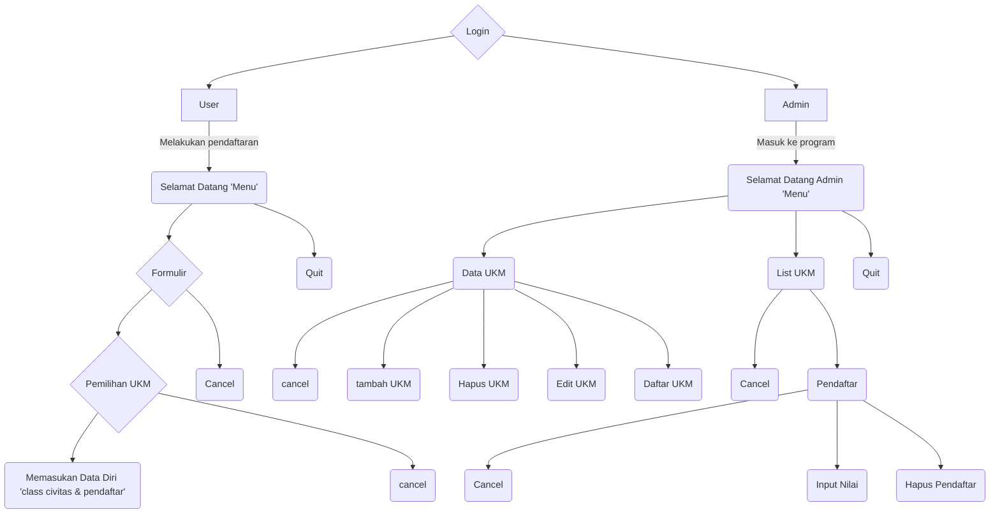

# Tahap 1
Perancangan arsitekur dan Draft Class.

## Pembagian kelas
1. [Civitas](#civitas)
2. [Pendaftar](#pendaftar)
3. [UKM](#ukm)
4. [Seleksi](#seleksi)

## Objek per kelas
### Civitas
#### Atribut:
1. nama `str`
2. NIM `int` (Private)
3. prodi `str`
4. fakultas `str`
5. tanggal_lahir `int`
6. angkatan `int`
7. kontak `int`

#### Draft Method:
- `get_nim()`: Mengambil data NIM.
- `tampilkan_info()`: Menampilkan informasi dasar civitas.
- `to_dict()`: Konversi objek ke dictionary untuk penyimpanan.

### Pendaftar
#### Atribut:
1. riwayat_organisasi `str`
2. status_kelulusan `str` (Private)
3. motivasi `str`
4. ukm_pilihan `str`
5. hasil_seleksi `Object Seleksi`

#### Draft Method:
- `get_status_kelulusan()`: Mengambil status kelulusan.
- `set_status_kelulusan()`: Mengubah status kelulusan.
- `tampilkan_info()`: (Override) Menampilkan info pendaftar dan statusnya.
- `to_dict()`: (Override) Konversi data pendaftar lengkap ke dictionary.

### UKM
#### Atribut:
1. nama_ukm `str`
2. desk_kegiatan `str`
3. kuota_pendaftar `int`
4. daftar_pendaftar `list`

#### Draft Method:
- `tambah_pendaftar()`: Menambahkan pendaftar ke list jika kuota tersedia.
- `to_dict()`: Konversi data UKM ke dictionary.

### Seleksi
#### Atribut:
1. nilai_wawancara `int`
2. nilai_keterampilan `int`
3. nilai_sikap `int`

#### Draft Method:
- `hitung_rata_rata()`: Logika bisnis menghitung nilai akhir.
- `to_dict()`: Konversi data nilai ke dictionary.

## Flow Pendaftaran User

