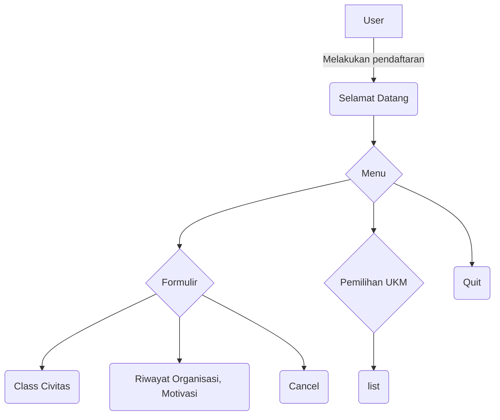

# Tahap 1
Perancangan arsitekur dan Draft Class.

## Pembagian kelas
1. [Civitas](#civitas)
2. [Pendaftar](#pendaftar)
3. [UKM](#ukm)
4. [Seleksi](#seleksi)

## Objek per kelas
### Civitas
1. nama `str`
2. NIM `int`
3. prodi `str`
4. fakultas `str`
5. tanggal_lahir `int`
6. angkatan `int`
7. kontak `int`

### Pendaftar
1. riwayat_organisasi `str`
2. status_kelulusan `boolean`
3. motivasi `str`

### UKM
1. nama_ukm `str`
2. desk_kegiatan `str`
3. kuota_pendaftar `int`

### Seleksi
1. nilai_wawancara `int`
2. nilai_keterampilan `int`
3. nilai_sikap `int`

## Flow pendaftaran

```
